<div align="center">

# Deep Learning for Video Description

### Comparing BLIP, GIT-VATEX, and Qwen2-VL for segment-level video description under a unified inference pipeline

[](https://python.org)
[](https://pytorch.org)
[](https://developer.nvidia.com/cuda-toolkit)
[](https://huggingface.co)
[](https://streamlit.io)
[](https://cs.stanford.edu/people/ranjaykrishna/densevid/)
[](#license)

*Bachelor's Thesis · "Deep Learning for Video Description"*  
*Department of Computer Science & Telecommunications, University of Thessaly*  
*Author: Tsiakiris Antonios · Advisor: Konstantinos Kolomvatsos, Associate Professor · February 2026*

<br>

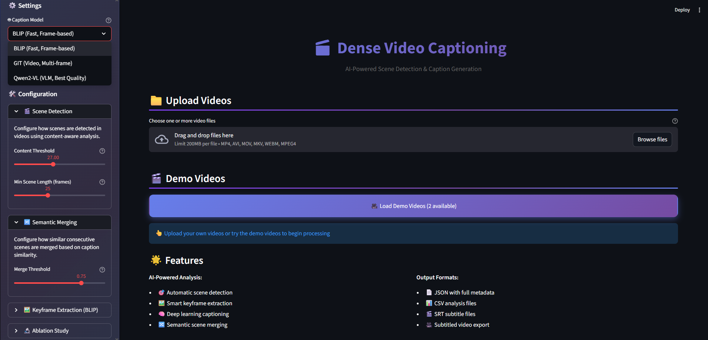

</div>

---

## 📖 Overview

Dense video captioning is the task of automatically segmenting a video into events and generating a natural language description for each one. This project approaches it as a two-stage inference pipeline: temporal segmentation via a content-based scene detector, followed by caption generation via a pretrained vision-language model, with no training or fine-tuning at any stage.

The pipeline serves as a controlled testbed for comparing three architectures that approach the captioning problem in fundamentally different ways:

- **BLIP**: an image captioning model that processes a single frame per segment, with no temporal context whatsoever
- **GIT-VATEX**: a video-aware model fine-tuned on video captions that processes multiple frames simultaneously using temporal position embeddings
- **Qwen2-VL**: a 2B-parameter instruction-tuned VLM that processes multiple frames with temporal position awareness via M-ROPE


All three receive the same segmentation output and are evaluated on the ActivityNet Captions benchmark, making the captioning model the only variable under study.

---

## ✨ Key Features

- **Three pretrained captioning engines**: BLIP, GIT-VATEX, Qwen2-VL, selectable via `--model` with no training or fine-tuning required
- **Content-based scene detection**: PySceneDetect with configurable sensitivity threshold
- **Model-specific frame extraction**: quality-based single-frame selection for BLIP; uniform temporal sampling for GIT-VATEX and Qwen2-VL
- **Semantic scene merging**: consecutive segments with similar captions are merged based on cosine similarity (Sentence-BERT, configurable threshold)
- **Streamlit web interface**: video upload, model selection, and interactive caption timeline
- **Multi-format export**: JSON, CSV, SRT subtitles, and subtitle-burned video
- **Evaluation suite**: end-to-end, oracle, and offline protocols with BLEU, METEOR, ROUGE-L, Precision, Recall, and temporal IoU curves

---

## 🛠️ Tech Stack

| Category | Technologies |
|----------|-------------|
| **Language** | Python 3.11+ |
| **Deep Learning** | PyTorch 2.6, HuggingFace Transformers, CUDA 12.4 |
| **Models** | BLIP, GIT (fine-tuned on VATEX), Qwen2-VL (4-bit quantized) |
| **Video Processing** | OpenCV, PyAV, PySceneDetect, FFmpeg |
| **NLP / Similarity** | Sentence-Transformers (SBERT), NLTK |
| **Evaluation** | BLEU, METEOR, ROUGE-L |
| **Web Interface** | Streamlit |
| **Data** | ActivityNet Captions benchmark |

---

## 🏗️ System Architecture

```
Video Input
    │
    ▼
┌─────────────────────────────┐
│   Scene Detection           │  ← PySceneDetect (ContentDetector)
│   (Adaptive Segmentation)   │    Adaptive sensitivity threshold
└────────────┬────────────────┘
             │  Segments [t_start, t_end]
             ▼
┌─────────────────────────────┐
│   Frame Extraction          │  ← BLIP:      1 frame  (sharpness + entropy scoring)
│   & Selection               │    GIT-VATEX: 6 frames (uniform temporal sampling)
│                             │    Qwen2-VL:  5 frames (uniform temporal sampling)
└────────────┬────────────────┘
             │  Frames per scene
             ▼
┌─────────────────────────────┐
│   Caption Generation        │  ← Selectable via --model flag
│   (Model Engine)            │    BLIP / GIT-VATEX / Qwen2-VL
└────────────┬────────────────┘
             │  Raw captions per scene
             ▼
┌─────────────────────────────┐
│   Semantic Merging          │  ← sentence-transformers embeddings
│   (Post-processing)         │    S = 0.7·S_centroid + 0.3·S_context ≥ 0.75
└────────────┬────────────────┘
             │  Merged events with timestamps
             ▼
┌─────────────────────────────┐
│   Export                    │  ← JSON / CSV / SRT / Subtitled Video
└─────────────────────────────┘
```

---

## 🔬 Pipeline Stages

| Stage | Description |
|-------|-------------|
| **1. Scene Detection** | Content-based scene boundary detection using PySceneDetect with configurable sensitivity threshold |
| **2. Frame Extraction** | Quality-based single-frame selection for BLIP (sharpness + entropy); uniform temporal sampling for GIT-VATEX and Qwen2-VL |
| **3. Caption Generation** | Each segment is captioned by the active model engine. The model is defined in `config.py`; CLI arguments override config at runtime. |
| **4. Semantic Merging** | Adjacent segments whose captions exceed a configurable cosine similarity threshold (Sentence-BERT embeddings) are merged into a single event. |
| **5. Export** | JSON, CSV, SRT subtitles, and subtitle-burned video |

---

## 🤖 Models

Three captioning architectures are evaluated under the same pipeline:

| | **BLIP** | **GIT-VATEX** | **Qwen2-VL** |
|---|---|---|---|
| **Architecture** | ViT-Large + encoder-decoder | Decoder-only Transformer (CLIP tokens) | 2B-param VLM (M-ROPE) |
| **Paradigm** | Image captioning | Video-aware captioning | Instruction-tuned VLM |
| **Frame Strategy** | 1 frame, quality-based (sharpness + entropy) | 6 frames, uniform temporal sampling | 5 frames, uniform + text prompt |
| **Temporal Awareness** | ❌ None | ✅ Temporal position embeddings | ✅ M-ROPE (1D text + 2D spatial + 3D temporal) |
| **Speed** | ~7.6 s/video | ~183 s/video | ~245.9 s/video |
| **Relative Speed** | 🟢 ~24× faster than Qwen2-VL | 🟡 Medium | 🔴 Slowest |
| **Caption Style** | Concise, object-centric | Concise, action-grounded | Verbose, descriptive |
| **Context** | Visual (Static) | Temporal (Motion) | Semantic (Reasoning) |

---

### 🔵 BLIP: `Salesforce/blip-image-captioning-large`

**Architecture:** ViT-Large visual encoder + bootstrapped text encoder-decoder. Pre-trained with three objectives: Image-Text Contrastive (ITC), Image-Text Matching (ITM), and Language Modeling (LM), with CapFilt filtering for noisy web captions.

**Single-image model** with no native temporal awareness. In this pipeline, each scene is represented by the single **best-quality frame**, selected via a composite sharpness + entropy score. This makes BLIP the fastest model by a wide margin (~24× faster than Qwen2-VL) and suitable for large-scale indexing scenarios where speed is critical.

**Trade-off:** Fast, but produces object-centric, visually grounded captions that lack temporal or action-level context.

---

### 🟢 GIT-VATEX: `microsoft/git-base-vatex`

**Architecture:** GenerativeImage2Text (Wang et al., 2022), a decoder-only Transformer conditioned on CLIP visual tokens. The base model is pre-trained on ~10 million image-text pairs. The VATEX checkpoint is fine-tuned on [VATEX](https://eric-xw.github.io/vatex-website/), a multilingual video captioning dataset of 41,250 clips (200K human-written captions).

**Video-aware input:** Supports multi-frame input via `num_image_with_embedding` temporal position embeddings. In this pipeline, **6 uniformly-sampled frames** per scene are passed simultaneously, giving the model temporal context within a segment.

**Trade-off:** Best overall lexicometric balance. Achieves the highest BLEU and ROUGE-L scores, producing concise, action-grounded captions consistent with ActivityNet annotation style.

---

### 🟠 Qwen2-VL (2B): `Qwen/Qwen2-VL-2B-Instruct`

**Architecture:** 2-billion-parameter Vision-Language Model from Alibaba Cloud (smallest variant of the Qwen2-VL family: 2B / 7B / 72B). Key innovations include **Naive Dynamic Resolution** (arbitrary image sizes → variable visual token counts) and **M-ROPE** (positional embeddings decomposed into 1D text, 2D spatial, and 3D temporal components for native video understanding).

**Implementation details in this pipeline:**
- **5 uniformly-sampled frames** passed as a `type: "video"` message in the chat template, a deliberate cost/quality trade-off
- **4-bit NF4 quantization** via `bitsandbytes` (float16 compute dtype) to fit in ≤6 GB VRAM
- **Flash Attention 2** auto-selected on Ampere (sm ≥ 80) GPUs; falls back to SDPA otherwise
- Temperature: 0.2 · Top-p: 0.9 · Max new tokens: 200

**Trade-off:** Highest METEOR score (best semantic overlap), but generates verbose, descriptive captions that diverge stylistically from the concise ActivityNet ground-truth annotations, penalizing n-gram metrics.

---

## 🧩 Semantic Merging Algorithm

After caption generation, consecutive scenes with semantically redundant captions are automatically merged:

```
S = 0.7 × S_centroid + 0.3 × S_context ≥ 0.75  →  merge
```

where `S_centroid` is the cosine similarity of sentence-transformer embeddings between the two captions, and `S_context` incorporates the preceding caption for narrative continuity.

**Example:**
> S1: *"A man holding a stick and throws a ball"*  
> S2: *"A man holding a bat and throws a ball"*  
> → Score = 0.878 → **merged into single event**

---

## ⚙️ Getting Started

### Prerequisites

- Python 3.11+
- NVIDIA GPU with CUDA 12.4+ (recommended: ≥8GB VRAM for BLIP/GIT, ≥12GB for Qwen2-VL)
- FFmpeg (for subtitle burning and video processing)

### Installation

```bash
# Clone the repository
git clone https://github.com/<your-username>/Dense-Video-Captioning-Thesis.git
cd Dense-Video-Captioning-Thesis

# Create virtual environment
python -m venv venv
source venv/bin/activate   # Linux/macOS
# venv\Scripts\activate    # Windows

# Install dependencies
pip install -r requirements.txt
```

> **Note:** PyTorch is configured for CUDA 12.4. For other CUDA versions, adjust the `--extra-index-url` in `requirements.txt` accordingly. See the [PyTorch installation guide](https://pytorch.org/get-started/locally/).

### Download Videos

To replicate evaluation results, download videos from the ActivityNet Captions dataset:

```bash
python scripts/download_videos.py
```

---

## 💻 Hardware Requirements

| Model | Min VRAM | Recommended | Notes |
|-------|:--------:|:-----------:|-------|
| **BLIP** | 3 GB | 6 GB | ViT-Large encoder |
| **GIT-VATEX** | 2 GB | 4 GB | Lightweight decoder-only |
| **Qwen2-VL 2B (4-bit)** | 3 GB | 6 GB | NF4 quantization via bitsandbytes |

> Inference times measured on a single NVIDIA GPU with CUDA 12.4. CPU-only inference is not recommended for Qwen2-VL.

---

## 📁 Project Structure

```
Dense-Video-Captioning-Thesis/
├── main.py                     # CLI entry point
├── app.py                      # Streamlit web interface
├── benchmark.py                # Benchmarking utilities
├── generate_plots.py           # Visualization generation
├── requirements.txt            # Python dependencies
│
├── src/                        # Core system modules
│   ├── config.py               # Centralized configuration
│   ├── scene_engine.py         # Scene detection (PySceneDetect)
│   ├── model_factory.py        # Model registry & factory
│   ├── merger.py               # Semantic scene merging (SBERT)
│   ├── exporter.py             # Multi-format export (JSON/SRT/XLSX/Video)
│   ├── logger.py               # Logging utilities
│   ├── utils.py                # Helper functions
│   └── engines/                # Captioning model engines
│       ├── blip.py             # BLIP engine
│       ├── git.py              # GIT-VATEX engine
│       └── qwen.py             # Qwen2-VL engine (4-bit NF4)
│
├── evaluation/                 # Evaluation framework
│   ├── e2e.py                  # End-to-end evaluation
│   ├── offline.py              # Offline results evaluation
│   ├── oracle.py               # Oracle temporal evaluation
│   ├── metrics.py              # BLEU / METEOR / ROUGE-L / Precision / Recall
│   ├── visualizer.py           # Plot generation
│   └── reports/                # Evaluation outputs
│       ├── e2e/                # End-to-end reports
│       ├── offline/            # Offline evaluation reports
│       ├── oracle/             # Oracle evaluation reports
│       └── plots/              # Generated visualizations
│           └── comparisons/    # Cross-model comparisons
│
├── scripts/
│   └── download_videos.py      # ActivityNet video downloader
│
└── data/                       # Runtime data (not tracked)
    ├── videos/                 # Input videos
    ├── results/                # Processing outputs per model
    ├── ground_truth/           # ActivityNet Captions annotations
    └── logs/                   # Execution logs
```

---

## 💻 Usage

### Command Line Interface

```bash
# Basic usage with default model (BLIP)
python main.py

# Select a specific model
python main.py --model blip
python main.py --model git
python main.py --model qwen

# Process with options
python main.py --model git --burn y --limit 10   # Burn subtitles, limit to 10 videos
python main.py --model qwen --no-merging          # Disable semantic merging
python main.py --model blip --random-frames       # Random frame selection (vs. quality-based)
python main.py --model git --force                # Reprocess already completed videos
```

On launch, the system validates configuration and prints a summary before processing begins:

<div align="center">
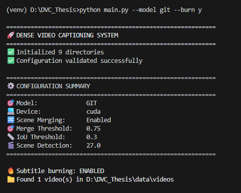
</div>

Each video is then processed stage by stage: scene detection, frame extraction, caption generation, semantic merging, and export:

<div align="center">
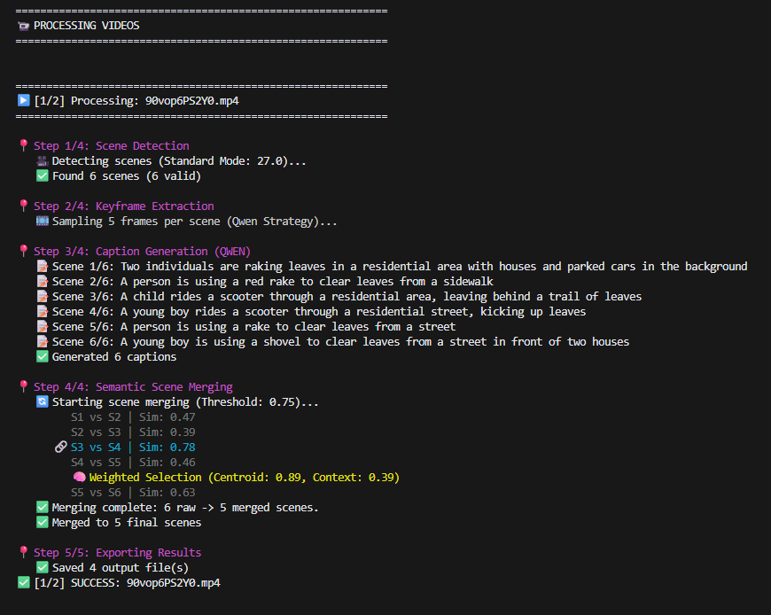
</div>

### CLI Arguments

| Argument | Description | Default |
|----------|-------------|---------|
| `--model` | Caption model: `blip`, `git`, `qwen` | `blip` |
| `--burn` | Burn subtitles into video: `y` / `n` | Interactive prompt |
| `--limit` | Maximum number of videos to process | All |
| `--no-merging` | Disable semantic scene merging | Enabled |
| `--random-frames` | Use random frame selection | Quality-based |
| `--ablation-name` | Custom experiment name for ablation | None |
| `--force` | Reprocess already completed videos | Skip completed |

---

### Web Interface (Streamlit)

```bash
streamlit run app.py
```

The web interface provides:

- Video upload or demo video selection
- Model selection (BLIP / GIT-VATEX / Qwen2-VL)
- Real-time processing progress visualization
- Interactive timeline with generated captions
- Export results in multiple formats

<div align="center">

</div>

A short demo of the interface in action:

<div align="center">
  <video src="docs/assets/demo_interface.mp4" controls width="800">
    <a href="docs/assets/demo_interface.mp4">▶ Watch demo video</a>
  </video>
</div>

---

## 🔧 Configuration Reference

Key parameters in `src/config.py`:

```python
# Scene detection
SCENE_THRESHOLD        = 27.0   # ContentDetector sensitivity
MIN_SCENE_LEN          = 15     # Minimum scene length (frames)

# Semantic merging
MERGE_THRESHOLD        = 0.75   # Cosine similarity threshold
MERGE_WEIGHT_CENTROID  = 0.7    # Weight for centroid similarity
MERGE_WEIGHT_CONTEXT   = 0.3    # Weight for context similarity

# Qwen2-VL
QWEN_MODEL_NAME        = "Qwen/Qwen2-VL-2B-Instruct"
QWEN_MAX_LENGTH        = 200
QWEN_TEMPERATURE       = 0.2
QWEN_TOP_P             = 0.9
QWEN_NUM_FRAMES        = 5

# GIT-VATEX
GIT_NUM_FRAMES         = 6
```

---

## 📊 Evaluation

### Methodology

The system is evaluated on the **ActivityNet Captions** validation set (99 videos) using three protocols:

| Protocol | Description |
|----------|-------------|
| **End-to-End** | Full pipeline: scene detection + captioning. Predicted segments are matched to ground-truth events via temporal IoU. Reports Precision, Recall, and NLP metrics on matched pairs. |
| **Oracle** | Ground-truth segment boundaries are provided; only caption quality is evaluated. Isolates captioning performance from localization errors. |
| **Offline** | Equivalent to end-to-end with the matching threshold τ swept from 0.1 to 0.9 to build precision/recall curves. |

**Temporal Localization**

| Metric | Description |
|--------|-------------|
| **Precision** | Fraction of predicted segments that match a ground-truth event (tIoU ≥ threshold) |
| **Recall** | Fraction of ground-truth events successfully covered by predictions |

**Caption Quality (NLG)**

| Metric | Description |
|--------|-------------|
| **BLEU-3 / BLEU-4** | N-gram precision measuring lexical overlap with reference captions (3-gram / 4-gram) |
| **METEOR** | Semantic similarity score accounting for synonyms, stemming, and word order |
| **ROUGE-L** | Longest common subsequence overlap between generated and reference captions |

A predicted segment is a **hit** if tIoU ≥ τ (default τ = 0.3). NLP scores are computed only on matched pairs.

---

### Running the Evaluation

All evaluation modes are unified under `benchmark.py`, which validates inputs, prints a configuration summary, and dispatches to the appropriate module.

```bash
# ── End-to-End: full pipeline on all 99 videos ──────────────────────────────
python benchmark.py e2e --model blip
python benchmark.py e2e --model git
python benchmark.py e2e --model qwen

# Quick sanity check on 5 videos before a full run
python benchmark.py e2e --model qwen --limit 5

# Replicate paper results with stricter IoU matching
python benchmark.py e2e --model git --threshold 0.5

# Use a custom ground-truth split
python benchmark.py e2e --model blip --json data/ground_truth/val_2.json

# ── Offline: re-score existing results without re-running inference ──────────
python benchmark.py offline --model blip
python benchmark.py offline --model git  --threshold 0.4
python benchmark.py offline --model qwen --threshold 0.5

# ── Oracle: evaluate caption quality with GT timestamps (upper bound) ────────
python benchmark.py oracle --model blip
python benchmark.py oracle --model git
python benchmark.py oracle --model qwen --limit 10

# ── Plots: regenerate all figures from existing JSON reports ─────────────────
python generate_plots.py
```

**Benchmark arguments:**

| Argument | Description | Default |
|----------|-------------|---------|
| `mode` | Evaluation mode: `e2e`, `offline`, `oracle` | required |
| `--model` | Caption model: `blip`, `git`, `qwen` | `blip` |
| `--threshold` | IoU threshold τ for matching predictions to GT | `0.3` |
| `--limit` | Number of videos to evaluate (useful for quick tests) | all |
| `--json` | Path to ground-truth JSON file | `data/ground_truth/val_1.json` |
| `--videos` | Path to videos directory | `data/videos/` |

---

### End-to-End Results (tIoU = 0.3, 99 videos)

| Model | Precision | Recall | BLEU-3 | BLEU-4 | METEOR | ROUGE-L |
|-------|:---------:|:------:|:------:|:------:|:------:|:-------:|
| BLIP | 20.13% | 54.01% | 3.60% | 1.67% | 13.13% | 19.68% |
| GIT-VATEX | **21.03%** | 55.79% | **5.17%** | **1.94%** | 15.88% | **22.28%** |
| Qwen2-VL | 20.70% | **56.08%** | 3.97% | 1.84% | **17.03%** | 20.64% |

**Key observations:**

- **GIT-VATEX** achieves the best lexicometric balance (highest BLEU-3, BLEU-4, and ROUGE-L), reflecting its fine-tuning on video-specific captioning data with an annotation style compatible with ActivityNet.
- **Qwen2-VL** achieves the highest METEOR (+1.15 pp over GIT-VATEX), capturing better semantic meaning despite generating more verbose captions that are penalized by n-gram overlap metrics.
- **BLIP** is ~24× faster than Qwen2-VL but produces lower-quality captions due to its single-frame, image-level approach that lacks temporal or action-level context.
- All three models show significantly higher recall than precision, confirming **over-segmentation**, a property of the shared scene detector and not of any individual model. The precision/recall behavior is discussed in detail below.

<div align="center">

| End-to-End Model Comparison | Oracle Model Comparison |
|:--:|:--:|
| 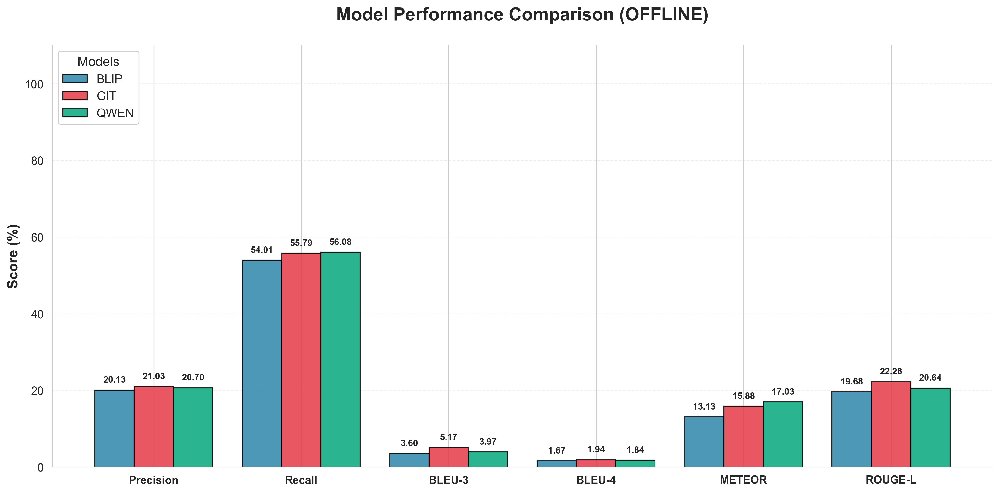 | 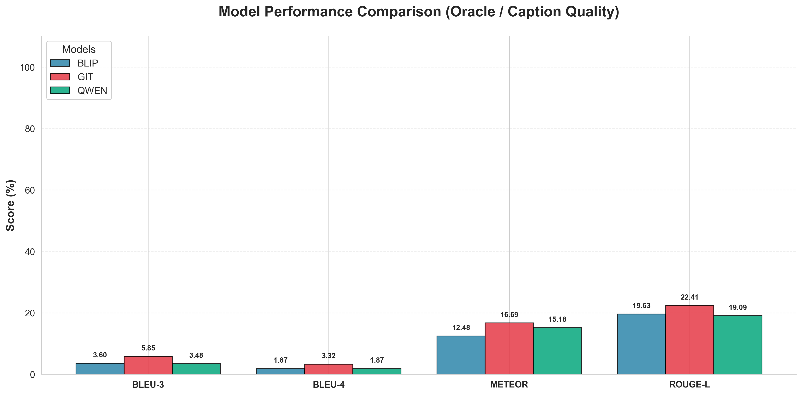 |

</div>

---

### Oracle Results: Caption Quality in Isolation

Oracle evaluation uses ground-truth segment boundaries, isolating caption quality from localization errors:

| Model | BLEU-3 | BLEU-4 | METEOR | ROUGE-L |
|-------|:------:|:------:|:------:|:-------:|
| BLIP | 3.60% | 1.87% | 12.48% | 19.63% |
| **GIT-VATEX** | **5.85%** | **3.32%** | **16.69%** | **22.41%** |
| Qwen2-VL | 3.48% | 1.87% | 15.18% | 19.09% |

Under oracle conditions, **GIT-VATEX leads across all four metrics**, confirming that its advantage is primarily due to caption quality rather than temporal alignment. Qwen2-VL's relatively lower oracle scores despite strong METEOR in end-to-end evaluation suggest that some of its semantic gains come from loosely-matched segments rather than genuine caption precision.

<div align="center">

| BLIP Performance | GIT-VATEX Performance | Qwen2-VL Performance |
|:--:|:--:|:--:|
| 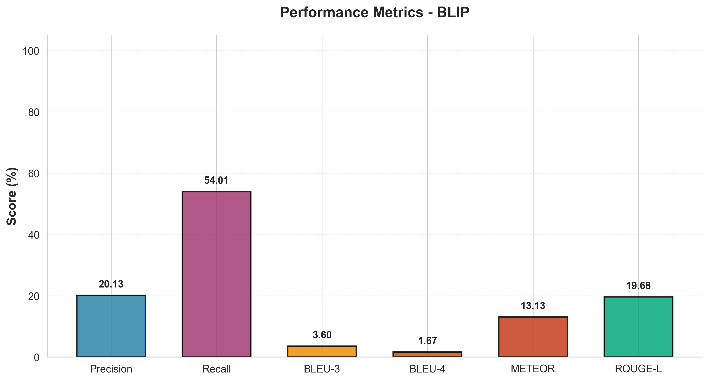 | 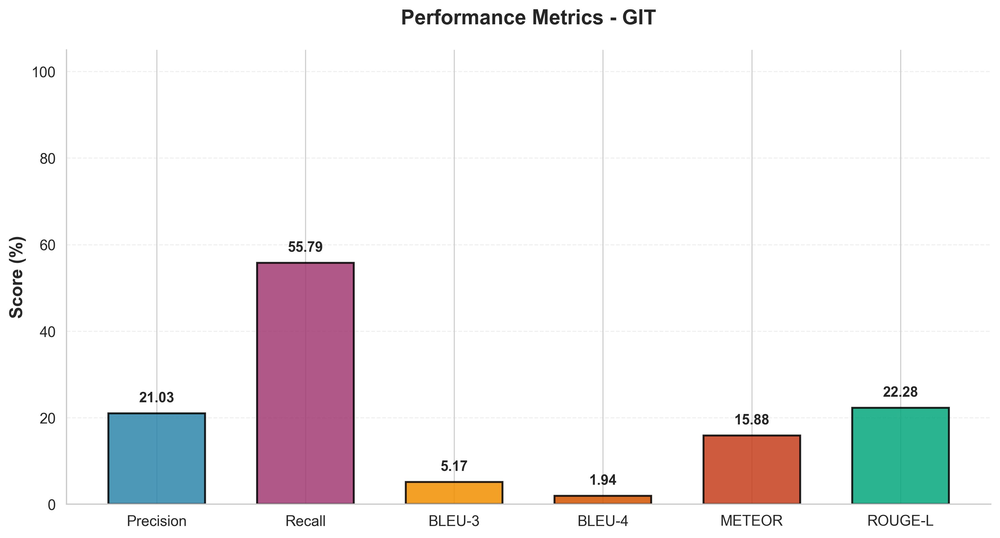 |  |

</div>

---

### Temporal Localization Analysis

<div align="center">

| BLIP | GIT-VATEX | Qwen2-VL |
|:--:|:--:|:--:|
| 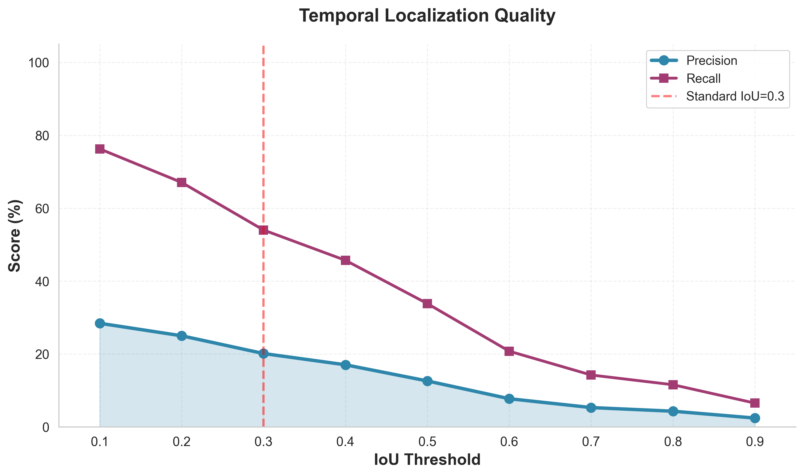 | 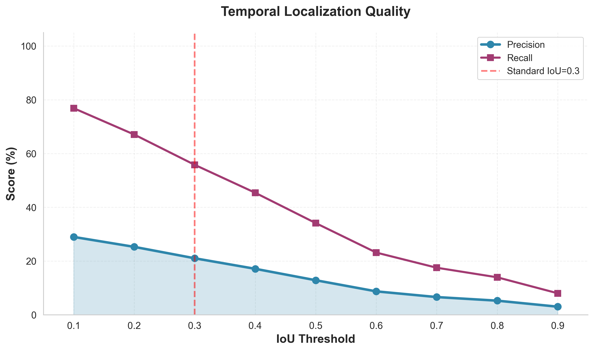 | 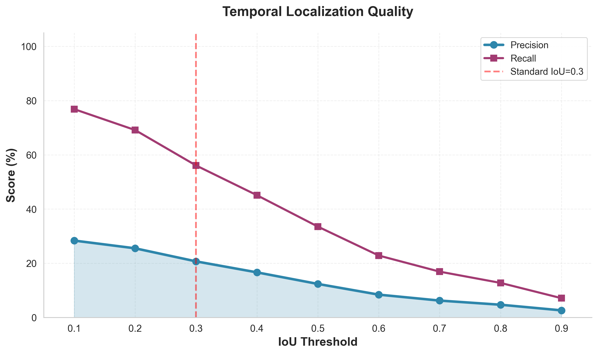 |

</div>

The three curves above are virtually identical, which is entirely expected. **Temporal localization is determined solely by PySceneDetect (ContentDetector)**, which is shared identically across all three models. These plots are not a reflection of model quality; they reflect the performance of the scene detector alone.

The precision/recall numbers at each tIoU threshold confirm this:

| tIoU | BLIP P / R | GIT-VATEX P / R | Qwen2-VL P / R |
|:----:|:----------:|:---------------:|:--------------:|
| 0.1 | 28.43% / 76.26% | 28.97% / 76.85% | 28.37% / 76.85% |
| 0.2 | 25.00% / 67.06% | 25.28% / 67.06% | 25.52% / 69.14% |
| 0.3 | 20.13% / 54.01% | 21.03% / 55.79% | 20.70% / 56.08% |
| 0.4 | 17.04% / 45.70% | 17.11% / 45.40% | 16.65% / 45.10% |
| 0.5 | 12.61% / 33.83% | 12.86% / 34.12% | 12.38% / 33.53% |
| 0.6 | 7.74% / 20.77% | 8.72% / 23.15% | 8.43% / 22.85% |
| 0.7 | 5.31% / 14.24% | 6.60% / 17.51% | 6.24% / 16.91% |
| 0.8 | 4.31% / 11.57% | 5.26% / 13.95% | 4.71% / 12.76% |
| 0.9 | 2.43% / 6.53% | 3.02% / 8.01% | 2.63% / 7.12% |

The marginal differences between columns are **not attributable to model quality**. They are an indirect side-effect of the **semantic merging step**: when two adjacent scenes receive captions that are similar enough to trigger a merge, the two segments are joined into one, which can slightly shift the resulting boundary closer to or further from a ground-truth boundary. Since different captioning models may produce similar or dissimilar captions for the same pair of scenes, the merge step fires differently per model, introducing a small per-video divergence. This is purely a post-processing artifact.

The real takeaway is about **the system as a whole**: content-based scene detection captures visual transitions (cuts, lighting changes, camera movement) rather than the semantic activity boundaries that ActivityNet Captions ground-truth events represent. This fundamental mismatch is why precision and recall collapse steeply at higher IoU thresholds, and why all values, regardless of which captioning model is used, follow the same curve. Replacing the scene detector with a semantic or action-aware temporal proposal network would be the highest-impact improvement for this pipeline.

---

### Score Distributions

<div align="center">

| BLIP | GIT-VATEX | Qwen2-VL |
|:--:|:--:|:--:|
| 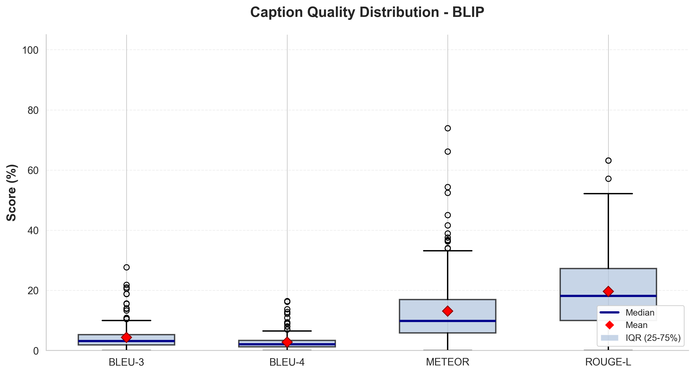 | 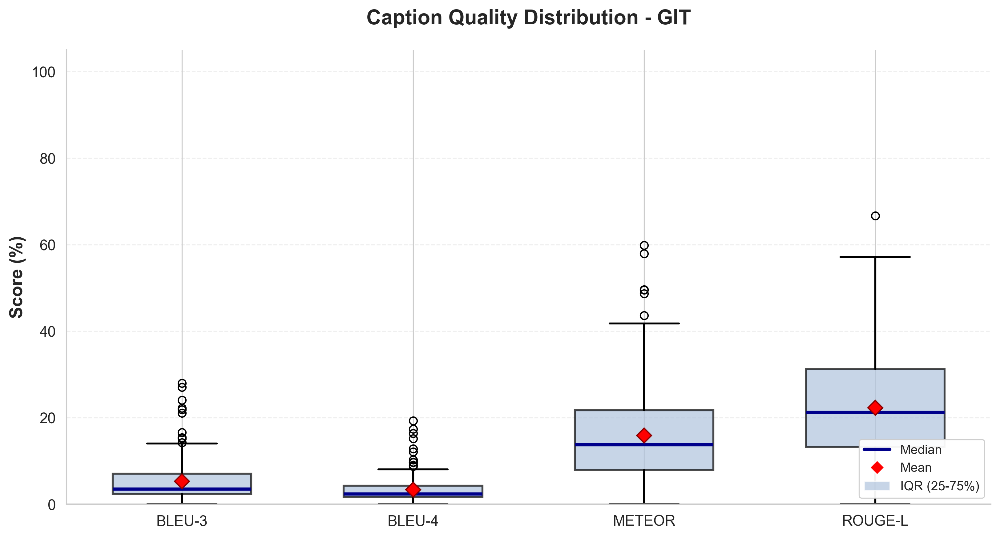 | 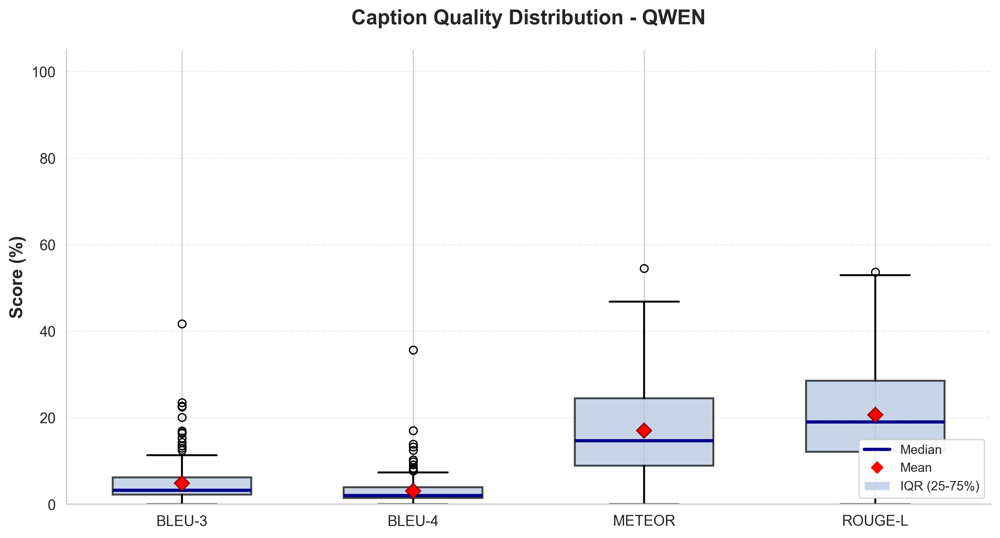 |

</div>

---

### Caption Length Comparison

<div align="center">

| End-to-End | Oracle |
|:--:|:--:|
| 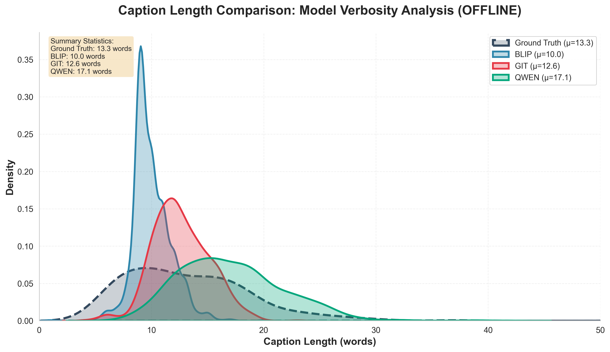 | 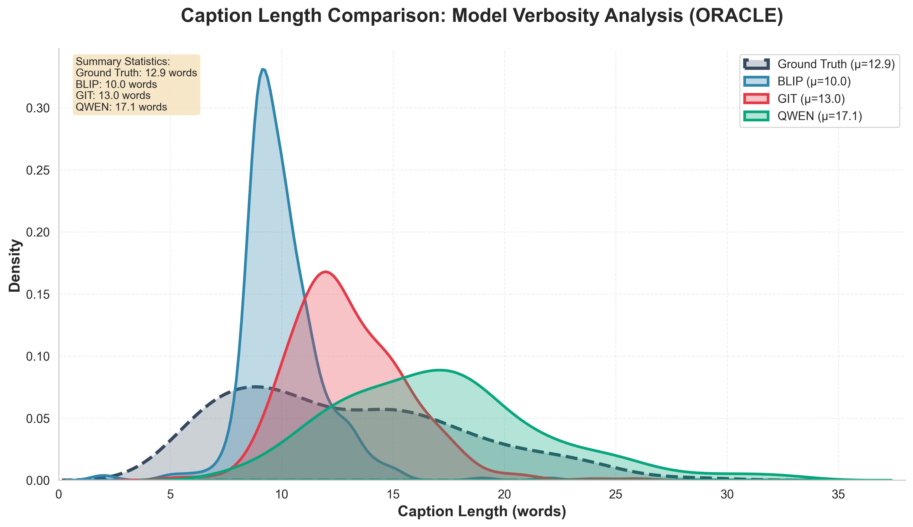 |

</div>

Caption length distributions reveal a key stylistic difference: **Qwen2-VL generates significantly longer captions** compared to BLIP and GIT-VATEX, which better matches the verbosity of some ActivityNet annotations but introduces more n-gram mismatches in others. This partially explains why METEOR (a metric more tolerant of paraphrasing) favors Qwen2-VL while BLEU and ROUGE-L favor GIT-VATEX.

---

### Qualitative Examples

#### Example 1: Object recognition (Video: `7eR0DyDg7wQ`, tIoU=0.42)
| | Caption |
|--|---------|
| 🎯 Ground Truth | *An old style radio is sitting on a counter.* |
| 🔵 BLIP | *An old fashioned radio sitting on top of a table* |
| 🟢 GIT-VATEX | *An old radio is on a counter in a kitchen* |
| 🟠 Qwen2-VL | *An antique wooden radio sits on a kitchen counter next to a coffee maker* |

BLIP and GIT-VATEX are concise and accurate. Qwen2-VL adds unprompted details ("antique", "next to a coffee maker") that increase verbosity but deviate from ground truth.

---

#### Example 2: Continuous action (Video: `BH-kBRn84i8`, tIoU=0.52)
| | Caption |
|--|---------|
| 🎯 Ground Truth | *A man wearing a hat is seen pushing a lawn mower across a yard.* |
| 🔵 BLIP | *A man in a white shirt and jeans is pushing a lawn mower* |
| 🟢 GIT-VATEX | *A man is mowing the lawn in the garden* |
| 🟠 Qwen2-VL | *A man wearing a white shirt and jeans is pushing a lawn mower across a lawn with a headband on* |

All three correctly identify the main activity. GIT-VATEX produces the most concise description aligned with annotation conventions. Qwen2-VL over-specifies clothing details.

---

#### Example 3: Musical performance (Video: `91XkPU8A5hs`, tIoU=0.82)
| | Caption |
|--|---------|
| 🎯 Ground Truth | *A woman in a black shirt is playing a violin.* |
| 🔵 BLIP | *A woman holding a violin in front of a green background* |
| 🟢 GIT-VATEX | *A woman is playing a string instrument in front of a camera* |
| 🟠 Qwen2-VL | *A woman is playing the violin with a bow in front of a green background* |

Qwen2-VL achieves METEOR = 0.545, the highest of the three, correctly identifying both the instrument and the action of playing. BLIP detects the instrument but not the activity; GIT-VATEX identifies the activity but hedges on the instrument type.

---

## 📄 Thesis

The full thesis document (118 pages, in Greek with English abstract) covers:

1. **Deep Learning Models for Video Processing**: CNNs, RNNs, Transformers, Vision Transformers, Vision-Language Models
2. **Dense Video Captioning Algorithms**: Proposal-based, end-to-end, and VLM-based approaches
3. **Proposed System**: Architecture, scene detection, keyframe extraction, caption generation, semantic merging
4. **Experimental Evaluation**: Quantitative results, ablation studies, qualitative analysis

---

## 📋 License

This project was developed as part of a Bachelor's thesis at the **University of Thessaly, Department of Computer Science & Telecommunications**. It is intended for academic and educational purposes.

---

## 🙏 Acknowledgments

- **Advisor:** Konstantinos Kolomvatsos, Associate Professor, University of Thessaly
- **Models:** [Salesforce BLIP](https://huggingface.co/Salesforce/blip-image-captioning-large), [Microsoft GIT](https://huggingface.co/microsoft/git-base-vatex), [Qwen2-VL](https://huggingface.co/Qwen/Qwen2-VL-2B-Instruct)
- **Dataset:** [ActivityNet Captions](https://cs.stanford.edu/people/ranjaykrishna/densevid/)
- **Tools:** [PySceneDetect](https://www.scenedetect.com/), [Sentence-Transformers](https://www.sbert.net/), [HuggingFace](https://huggingface.co/)

---

<div align="center">

*Built with ❤️ at the University of Thessaly · February 2026*

[](https://www.linkedin.com/in/antonis-tsiakiris)

</div>

</div>
